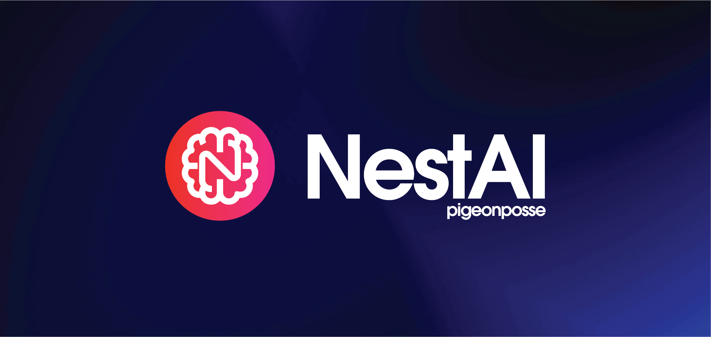

# NestAI by _PIGEONPOSSE_

[]

[](https://pigeonposse.com/)
[](https://pigeonposse.com/?popup=about)
[](https://github.com/pigeon-posse)
[](https://pigeonposse.com/?popup=donate)

## Universal AI Interface with Advanced Features

**NestAI** is a comprehensive Python library designed to simplify and enhance interactions with AI models across multiple providers. It offers a unified interface that abstracts away the complexities of working with different AI services, while providing advanced features like semantic caching, cost optimization, and detailed metrics tracking. NestAI is built to be both simple for beginners and powerful for advanced users, making AI integration seamless for any project.

The core of NestAI is its ability to intelligently manage AI requests, automatically selecting the most appropriate and cost-effective provider based on your needs. With built-in security features like PII detection and redaction, NestAI ensures your data remains protected while providing transparent insights into how decisions are made through its comprehensive logging and metrics systems.

> ⚠️ **Version 1.0.0**. API may evolve in future releases.

> 💡 **Semantic Caching** reduces costs and improves response times by intelligently reusing similar responses.

## Features

- **🚀 Simple Interface**: Use AI with just a single line of code
- **🔄 Multiple Providers**: Support for OpenAI, Anthropic, Mistral, Cohere, and more
- **💰 Cost Optimization**: Automatically select the most cost-effective provider and model
- **⚡ Caching**: Avoid redundant API calls with both exact and semantic caching
- **📊 Streaming**: Real-time text streaming for interactive applications
- **🔒 Security**: PII detection and redaction, encryption, and audit trails
- **📈 Metrics**: Detailed usage tracking and performance metrics
- **🧩 Customization**: Plugin system for extending functionality
- **🔍 Transparency**: Decision logging and cost estimation
- **📦 Batch Processing**: Process multiple requests efficiently
- **💬 Conversation Management**: Manage conversations with context and memory
- **🔄 Pipeline Processing**: Create custom processing pipelines

## Prerequisites

- Python 3.8 or higher
- API keys for the AI providers you wish to use

## Installation

To install NestAI, use pip:

```bash
# Using pip
pip install nestai

# Using pipenv
pipenv install nestai

# Using poetry
poetry add nestai
```

## ☕ Donate

Help us to develop more interesting things.

[](https://pigeonposse.com/?popup=donate)

## 📜 License

This software is licensed with **[GPL-3.0](/LICENSE)**.

[](/LICENSE)

## 🐦 About us

_PigeonPosse_ is a ✨ **code development collective** ✨ focused on creating practical and interesting tools that help developers and users enjoy a more agile and comfortable experience. Our projects cover various programming sectors and we do not have a thematic limitation in terms of projects.

[](https://github.com/pigeonposse)

## 📜 License

This software is licensed with **[GPL-3.0](/LICENSE)**.

[](/LICENSE)

## 🐦 About us

_PigeonPosse_ is a ✨ **code development collective** ✨ focused on creating practical and interesting tools that help developers and users enjoy a more agile and comfortable experience. Our projects cover various programming sectors and we do not have a thematic limitation in terms of projects.

[](https://github.com/pigeonposse)

### Collaborators

|                                                                                    | Name        | Role         | GitHub                                         |
| ---------------------------------------------------------------------------------- | ----------- | ------------ | ---------------------------------------------- |
|  | Alejo |   Author & Development   | [@alejomalia](https://github.com/alejomalia) |
|  | PigeonPosse | Collective | [@PigeonPosse](https://github.com/pigeonposse) |

[](https://pigeonposse.com)
[](https://pigeonposse.com?popup=about)
[](https://pigeonposse.com/?popup=donate)
[](https://github.com/pigeonposse)
[](https://twitter.com/pigeonposse_)
[](https://www.instagram.com/pigeon.posse/)
[](https://medium.com/@pigeonposse)

